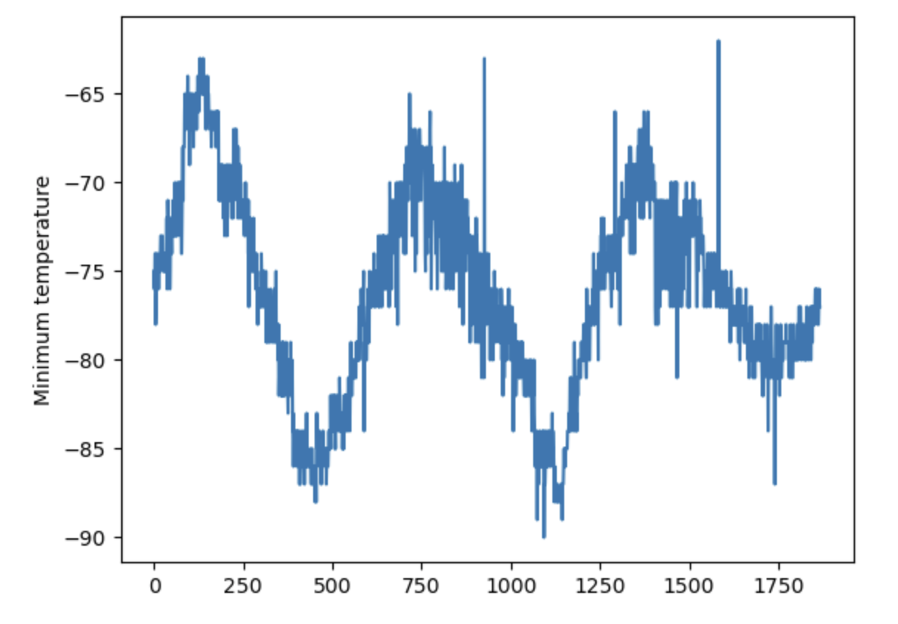

# Mars Data
News and Space Weather for Mars

This repoistory contains two Jupyter notebooks, the first notebook, named part_1_mars_news.ipynb, contains news stories screen scraped from a static version of a NASA Mars news website. The second notebook, named part_2_mars_weather.ipynb, contains data and analysis on Martian weather also scraped from a static copy of a NASA website. 

## Part One: Mars News
This notebook performs the following tasks:
- Launches a chrome browser using Splinter
- Visits the static NASA news site
- Scrapes the first page of the site using Beautiful Soup
- Stores the titles and summaries of all the news stories from the first page of the site in a list
- Closes the browser session

## Part Two: Martian Weather Analysis
This notebook performs the following tasks:
- Launches a chrome browser using Splinter
- Identifies the one table on the page using BS4
- Loops through all records in the table to identify and store a list of lists containing detailed weather data for Mars organized by observation
- Converts the list of lists into a dataframe for analysis and graphing
- Cleans and organizes the dataframe assigning appropriate datatypes and column names
- Analyizes the resulting dataframe to count the number of observations by month, the total number of observations, and the min temps by month
- Plots the results of the above analysis in order to easily visualize weather on Mars including atmospheric pressures, minimum temperatures, and periodicity of minimum temperatures
- Saves the dataframe into 'mars_dat.csv' within the 'Resources' folder

All code is my own or is derived from coursework with one exception. The idea of using a conversion dictionary to simplify the process of type casting multiple columns in a dataframe was taken from geeksforgeeks.org, specifically the following web page: https://www.geeksforgeeks.org/change-data-type-for-one-or-more-columns-in-pandas-dataframe/
